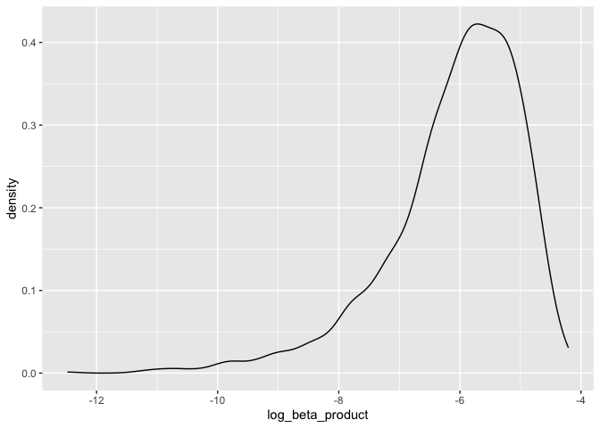
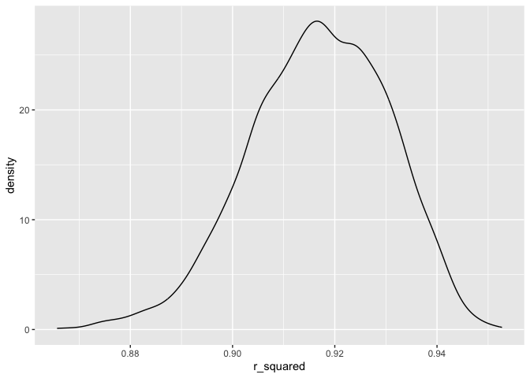

Homework 6
================
Eunsuh Cho

``` r
library(tidyverse)
```

    ## ── Attaching core tidyverse packages ──────────────────────── tidyverse 2.0.0 ──
    ## ✔ dplyr     1.1.3     ✔ readr     2.1.4
    ## ✔ forcats   1.0.0     ✔ stringr   1.5.0
    ## ✔ ggplot2   3.4.4     ✔ tibble    3.2.1
    ## ✔ lubridate 1.9.2     ✔ tidyr     1.3.0
    ## ✔ purrr     1.0.2     
    ## ── Conflicts ────────────────────────────────────────── tidyverse_conflicts() ──
    ## ✖ dplyr::filter() masks stats::filter()
    ## ✖ dplyr::lag()    masks stats::lag()
    ## ℹ Use the conflicted package (<http://conflicted.r-lib.org/>) to force all conflicts to become errors

``` r
library(modelr)
library(mgcv)
```

    ## Loading required package: nlme
    ## 
    ## Attaching package: 'nlme'
    ## 
    ## The following object is masked from 'package:dplyr':
    ## 
    ##     collapse
    ## 
    ## This is mgcv 1.9-0. For overview type 'help("mgcv-package")'.

``` r
library(dplyr)
library(knitr)

set.seed(1)
```

# Problem 1

# Problem 2

Downloading data

``` r
weather_df = 
  rnoaa::meteo_pull_monitors(
    c("USW00094728"),
    var = c("PRCP", "TMIN", "TMAX"), 
    date_min = "2022-01-01",
    date_max = "2022-12-31") |>
  mutate(
    name = recode(id, USW00094728 = "CentralPark_NY"),
    tmin = tmin / 10,
    tmax = tmax / 10) |>
  select(name, id, everything())
```

    ## using cached file: /Users/irenecho/Library/Caches/org.R-project.R/R/rnoaa/noaa_ghcnd/USW00094728.dly

    ## date created (size, mb): 2023-09-28 10:20:05.358275 (8.524)

    ## file min/max dates: 1869-01-01 / 2023-09-30

Creating 5000 bootstrap samples

``` r
bootstrap_df = weather_df |> 
  modelr::bootstrap(n = 5000) |> 
  mutate(
    models = map(strap, \(df) lm(tmax ~ tmin + prcp, data = df)),
    results = map(models, broom::tidy),
    rsq = map(models, broom::glance)) |> 
  select(results, .id, rsq) |> 
  unnest(results) |> 
  filter(term %in% c("tmin", "prcp")) |> 
  group_by(.id) |> 
  mutate(beta1xbeta2 = prod(estimate),
         log_beta_product = log(beta1xbeta2)) |> 
  select(log_beta_product, rsq) |> 
  unnest(rsq) |> 
  janitor::clean_names() |> 
  select(log_beta_product, id, r_squared) |> 
  unique()
```

    ## Warning: There were 3361 warnings in `mutate()`.
    ## The first warning was:
    ## ℹ In argument: `log_beta_product = log(beta1xbeta2)`.
    ## ℹ In group 2: `.id = "0002"`.
    ## Caused by warning in `log()`:
    ## ! NaNs produced
    ## ℹ Run `dplyr::last_dplyr_warnings()` to see the 3360 remaining warnings.

    ## Adding missing grouping variables: `.id`

Plotting distribution of estimates

Log of the beta product

``` r
bootstrap_df |> 
  ggplot(aes(x = log_beta_product)) + geom_density()
```

    ## Warning: Removed 3361 rows containing non-finite values (`stat_density()`).

<!-- --> The
figure above displays the distribution of the estimates of the log of
the product of betas 1 and 2. The distribution is left skewed and
unimodal with a peak at approximately -5.75.

R-squared

``` r
bootstrap_df |> 
  ggplot(aes(x = r_squared)) + geom_density()
```

<!-- --> The
figure above displays the distribution of the estimates of the r-squared
value. The distribution is almost normal (slightly left skewed) and
unimodal with a peak at approximately 0.916.

Providing a 95% confidence interval

``` r
bootstrap_conf = bootstrap_df |> 
  unique() |>
  ungroup() |> 
  select(-id) |> 
  summarize(beta_mean = mean(log_beta_product, na.rm = TRUE),
            beta_low = quantile(log_beta_product, 0.025, na.rm = TRUE),
            beta_high = quantile(log_beta_product, 0.975, na.rm = TRUE),
            rs_mean = mean(r_squared),
            rs_low = quantile(r_squared, 0.025),
            rs_high = quantile(r_squared, 0.975))

bootstrap_conf |> knitr::kable()
```

| beta_mean |  beta_low | beta_high |   rs_mean |    rs_low |   rs_high |
|----------:|----------:|----------:|----------:|----------:|----------:|
| -6.089813 | -8.981559 | -4.601673 | 0.9168349 | 0.8885495 | 0.9406812 |

The 95% confidence interval for the log of the beta product is
(-8.9815594, -4.6016727).

The 95% confidence interval for r-squared is (0.8885495, 0.9406812).

# Problem 3

Downloading data

``` r
bw_df = read.csv("birthweight.csv")

bw_df = bw_df |> 
  janitor::clean_names() |> 
  mutate(
    babysex = as.factor(babysex),
    frace = as.factor(frace),
    malform = as.factor(malform),
    mrace = as.factor(mrace)) |> 
  drop_na()
```

Proposing a regression model

``` r
fit = lm(bwt ~ babysex + delwt + gaweeks + smoken + wtgain, data = bw_df)

fit |>
  broom::tidy() |>
  select(term, estimate, p.value) |>
  knitr::kable(digits=3)
```

| term        | estimate | p.value |
|:------------|---------:|--------:|
| (Intercept) |   -4.424 |   0.962 |
| babysex2    |  -92.770 |   0.000 |
| delwt       |    4.596 |   0.000 |
| gaweeks     |   61.244 |   0.000 |
| smoken      |   -7.216 |   0.000 |
| wtgain      |    4.993 |   0.000 |

``` r
summary(fit)
```

    ## 
    ## Call:
    ## lm(formula = bwt ~ babysex + delwt + gaweeks + smoken + wtgain, 
    ##     data = bw_df)
    ## 
    ## Residuals:
    ##      Min       1Q   Median       3Q      Max 
    ## -1707.32  -275.70     7.12   289.22  1461.28 
    ## 
    ## Coefficients:
    ##             Estimate Std. Error t value Pr(>|t|)    
    ## (Intercept)  -4.4240    91.9614  -0.048    0.962    
    ## babysex2    -92.7696    13.4464  -6.899 5.99e-12 ***
    ## delwt         4.5956     0.3350  13.720  < 2e-16 ***
    ## gaweeks      61.2441     2.1587  28.371  < 2e-16 ***
    ## smoken       -7.2165     0.9081  -7.946 2.43e-15 ***
    ## wtgain        4.9929     0.6817   7.324 2.86e-13 ***
    ## ---
    ## Signif. codes:  0 '***' 0.001 '**' 0.01 '*' 0.05 '.' 0.1 ' ' 1
    ## 
    ## Residual standard error: 442.3 on 4336 degrees of freedom
    ## Multiple R-squared:  0.255,  Adjusted R-squared:  0.2541 
    ## F-statistic: 296.8 on 5 and 4336 DF,  p-value: < 2.2e-16
